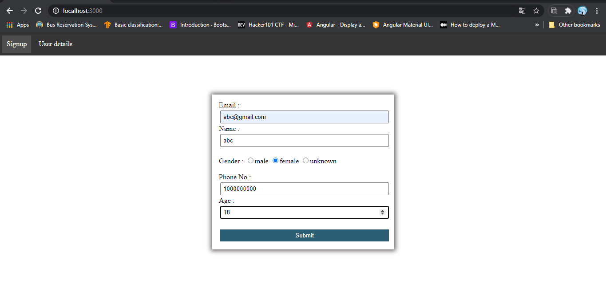
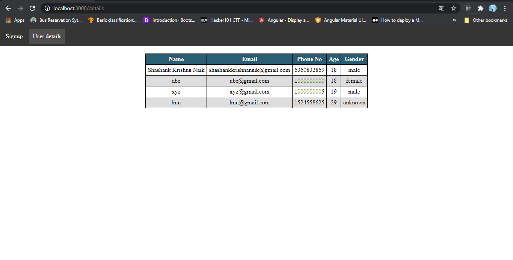

# Sign up form (ExpressJS-MongoDB-EJS)
This application collects user data and stores it to MongoDB and also  retrieves data from the database and display it on the website.

step 1: First create a directory for your new application and navigate into it.

<pre>
mkdir myapp
cd myapp
</pre>

step 2: Use the npm init command to create a package.json file for your application.

<pre>
npm init
</pre>

step 3: Now install Express and Mongoose in the myapp directory and save it in the dependencies list of your package.json file.

<pre>
npm install express mongoose --save
</pre>

step 4: Copy above code paste it in the myapp directory.

step 5: Run the application.

<pre>
node app.js
</pre>

